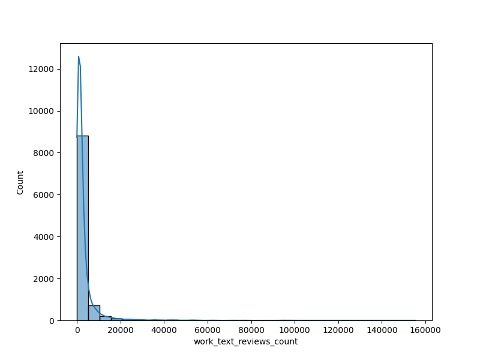

# Data Analysis Report

## Dataset Overview
The dataset contains 10000 rows and 23 columns. Here is a brief overview of the data:
   book_id  goodreads_book_id  best_book_id  work_id  books_count       isbn  \
0        1            2767052       2767052  2792775          272  439023483   
1        2                  3             3  4640799          491  439554934   
2        3              41865         41865  3212258          226  316015849   
3        4               2657          2657  3275794          487   61120081   
4        5               4671          4671   245494         1356  743273567   

         isbn13                       authors  original_publication_year  \
0  9.780439e+12               Suzanne Collins                     2008.0   
1  9.780440e+12  J.K. Rowling, Mary GrandPré                     1997.0   
2  9.780316e+12               Stephenie Meyer                     2005.0   
3  9.780061e+12                    Harper Lee                     1960.0   
4  9.780743e+12           F. Scott Fitzgerald                     1925.0   

                             original_title  ... ratings_count  \
0                          The Hunger Games  ...       4780653   
1  Harry Potter and the Philosopher's Stone  ...       4602479   
2                                  Twilight  ...       3866839   
3                     To Kill a Mockingbird  ...       3198671   
4                          The Great Gatsby  ...       2683664   

  work_ratings_count  work_text_reviews_count  ratings_1  ratings_2  \
0            4942365                   155254      66715     127936   
1            4800065                    75867      75504     101676   
2            3916824                    95009     456191     436802   
3            3340896                    72586      60427     117415   
4            2773745                    51992      86236     197621   

   ratings_3  ratings_4  ratings_5  \
0     560092    1481305    2706317   
1     455024    1156318    3011543   
2     793319     875073    1355439   
3     446835    1001952    1714267   
4     606158     936012     947718   

                                           image_url  \
0  https://images.gr-assets.com/books/1447303603m...   
1  https://images.gr-assets.com/books/1474154022m...   
2  https://images.gr-assets.com/books/1361039443m...   
3  https://images.gr-assets.com/books/1361975680m...   
4  https://images.gr-assets.com/books/1490528560m...   

                                     small_image_url  
0  https://images.gr-assets.com/books/1447303603s...  
1  https://images.gr-assets.com/books/1474154022s...  
2  https://images.gr-assets.com/books/1361039443s...  
3  https://images.gr-assets.com/books/1361975680s...  
4  https://images.gr-assets.com/books/1490528560s...  

[5 rows x 23 columns]

## Summary Statistics
{'book_id': {'count': 10000.0, 'mean': 5000.5, 'std': 2886.8956799071675, 'min': 1.0, '25%': 2500.75, '50%': 5000.5, '75%': 7500.25, 'max': 10000.0}, 'goodreads_book_id': {'count': 10000.0, 'mean': 5264696.5132, 'std': 7575461.863589608, 'min': 1.0, '25%': 46275.75, '50%': 394965.5, '75%': 9382225.25, 'max': 33288638.0}, 'best_book_id': {'count': 10000.0, 'mean': 5471213.5801, 'std': 7827329.890719957, 'min': 1.0, '25%': 47911.75, '50%': 425123.5, '75%': 9636112.5, 'max': 35534230.0}, 'work_id': {'count': 10000.0, 'mean': 8646183.4246, 'std': 11751060.824080037, 'min': 87.0, '25%': 1008841.0, '50%': 2719524.5, '75%': 14517748.25, 'max': 56399597.0}, 'books_count': {'count': 10000.0, 'mean': 75.7127, 'std': 170.4707276502585, 'min': 1.0, '25%': 23.0, '50%': 40.0, '75%': 67.0, 'max': 3455.0}, 'isbn13': {'count': 9415.0, 'mean': 9755044298883.463, 'std': 442861920665.57385, 'min': 195170342.0, '25%': 9780316192995.0, '50%': 9780451528640.0, '75%': 9780830777175.0, 'max': 9790007672390.0}, 'original_publication_year': {'count': 9979.0, 'mean': 1981.987674115643, 'std': 152.5766651675478, 'min': -1750.0, '25%': 1990.0, '50%': 2004.0, '75%': 2011.0, 'max': 2017.0}, 'average_rating': {'count': 10000.0, 'mean': 4.002191000000001, 'std': 0.25442748053872877, 'min': 2.47, '25%': 3.85, '50%': 4.02, '75%': 4.18, 'max': 4.82}, 'ratings_count': {'count': 10000.0, 'mean': 54001.2351, 'std': 157369.95643554686, 'min': 2716.0, '25%': 13568.75, '50%': 21155.5, '75%': 41053.5, 'max': 4780653.0}, 'work_ratings_count': {'count': 10000.0, 'mean': 59687.3216, 'std': 167803.7852374182, 'min': 5510.0, '25%': 15438.75, '50%': 23832.5, '75%': 45915.0, 'max': 4942365.0}, 'work_text_reviews_count': {'count': 10000.0, 'mean': 2919.9553, 'std': 6124.378131569907, 'min': 3.0, '25%': 694.0, '50%': 1402.0, '75%': 2744.25, 'max': 155254.0}, 'ratings_1': {'count': 10000.0, 'mean': 1345.0406, 'std': 6635.626262783453, 'min': 11.0, '25%': 196.0, '50%': 391.0, '75%': 885.0, 'max': 456191.0}, 'ratings_2': {'count': 10000.0, 'mean': 3110.885, 'std': 9717.123578396895, 'min': 30.0, '25%': 656.0, '50%': 1163.0, '75%': 2353.25, 'max': 436802.0}, 'ratings_3': {'count': 10000.0, 'mean': 11475.8938, 'std': 28546.44918318239, 'min': 323.0, '25%': 3112.0, '50%': 4894.0, '75%': 9287.0, 'max': 793319.0}, 'ratings_4': {'count': 10000.0, 'mean': 19965.6966, 'std': 51447.35838380065, 'min': 750.0, '25%': 5405.75, '50%': 8269.5, '75%': 16023.5, 'max': 1481305.0}, 'ratings_5': {'count': 10000.0, 'mean': 23789.8056, 'std': 79768.88561077177, 'min': 754.0, '25%': 5334.0, '50%': 8836.0, '75%': 17304.5, 'max': 3011543.0}}

## Missing Values
{'book_id': 0, 'goodreads_book_id': 0, 'best_book_id': 0, 'work_id': 0, 'books_count': 0, 'isbn': 700, 'isbn13': 585, 'authors': 0, 'original_publication_year': 21, 'original_title': 585, 'title': 0, 'language_code': 1084, 'average_rating': 0, 'ratings_count': 0, 'work_ratings_count': 0, 'work_text_reviews_count': 0, 'ratings_1': 0, 'ratings_2': 0, 'ratings_3': 0, 'ratings_4': 0, 'ratings_5': 0, 'image_url': 0, 'small_image_url': 0}

## Correlation Matrix
{'book_id': {'book_id': 1.0, 'goodreads_book_id': 0.1151542250729873, 'best_book_id': 0.10451581042885268, 'work_id': 0.11386077336475141, 'books_count': -0.2638407143748987, 'isbn13': -0.011291037256919776, 'original_publication_year': 0.049874666073990714, 'average_rating': -0.04087978276976166, 'ratings_count': -0.37317805088282024, 'work_ratings_count': -0.38265644900402224, 'work_text_reviews_count': -0.4192924520469794, 'ratings_1': -0.23940143054993687, 'ratings_2': -0.34576390293162224, 'ratings_3': -0.41327940995578105, 'ratings_4': -0.407078870043465, 'ratings_5': -0.33248551987800284}, 'goodreads_book_id': {'book_id': 0.1151542250729873, 'goodreads_book_id': 1.0, 'best_book_id': 0.9666202280510783, 'work_id': 0.9293557951065965, 'books_count': -0.1645781132281244, 'isbn13': -0.048245952597144155, 'original_publication_year': 0.13378973916430703, 'average_rating': -0.024848366694833045, 'ratings_count': -0.07302296072682894, 'work_ratings_count': -0.06376009930046676, 'work_text_reviews_count': 0.11884477199004521, 'ratings_1': -0.03837517827163446, 'ratings_2': -0.05657115661164492, 'ratings_3': -0.07563401403101903, 'ratings_4': -0.06331040494862238, 'ratings_5': -0.05614467450588117}, 'best_book_id': {'book_id': 0.10451581042885268, 'goodreads_book_id': 0.9666202280510783, 'best_book_id': 1.0, 'work_id': 0.899258347865944, 'books_count': -0.15923978629895047, 'isbn13': -0.047252526943741505, 'original_publication_year': 0.13144232652162838, 'average_rating': -0.021186976943576245, 'ratings_count': -0.06918188865834952, 'work_ratings_count': -0.05583462320172786, 'work_text_reviews_count': 0.12589277062401424, 'ratings_1': -0.033893810676640795, 'ratings_2': -0.049284209763921276, 'ratings_3': -0.06701410382837872, 'ratings_4': -0.05446200723576491, 'ratings_5': -0.04952448011831339}, 'work_id': {'book_id': 0.11386077336475141, 'goodreads_book_id': 0.9293557951065965, 'best_book_id': 0.899258347865944, 'work_id': 1.0, 'books_count': -0.10943559449223915, 'isbn13': -0.0393197951737402, 'original_publication_year': 0.10797162836357632, 'average_rating': -0.017555424736745106, 'ratings_count': -0.06272043125204012, 'work_ratings_count': -0.05471209877738029, 'work_text_reviews_count': 0.09698531520142002, 'ratings_1': -0.034590254483539334, 'ratings_2': -0.051366817603748526, 'ratings_3': -0.06674590238429455, 'ratings_4': -0.05477538394045195, 'ratings_5': -0.046745347013583224}, 'books_count': {'book_id': -0.2638407143748987, 'goodreads_book_id': -0.1645781132281244, 'best_book_id': -0.15923978629895047, 'work_id': -0.10943559449223915, 'books_count': 1.0, 'isbn13': 0.01786488362256092, 'original_publication_year': -0.3217531031422836, 'average_rating': -0.06988827020098386, 'ratings_count': 0.3242348400810117, 'work_ratings_count': 0.33366387680574255, 'work_text_reviews_count': 0.19869788167736252, 'ratings_1': 0.22576273903712912, 'ratings_2': 0.3349232577047334, 'ratings_3': 0.38369948855820096, 'ratings_4': 0.34956406578445615, 'ratings_5': 0.27955872502528073}, 'isbn13': {'book_id': -0.011291037256919776, 'goodreads_book_id': -0.048245952597144155, 'best_book_id': -0.047252526943741505, 'work_id': -0.0393197951737402, 'books_count': 0.01786488362256092, 'isbn13': 1.0, 'original_publication_year': -0.004612142594340622, 'average_rating': -0.025666863935200186, 'ratings_count': 0.008903588958501078, 'work_ratings_count': 0.009165556880160772, 'work_text_reviews_count': 0.009552855041821896, 'ratings_1': 0.006053691774245719, 'ratings_2': 0.010345488455756223, 'ratings_3': 0.012142495347605963, 'ratings_4': 0.01016078352384304, 'ratings_5': 0.00662185372766455}, 'original_publication_year': {'book_id': 0.049874666073990714, 'goodreads_book_id': 0.13378973916430703, 'best_book_id': 0.13144232652162838, 'work_id': 0.10797162836357632, 'books_count': -0.3217531031422836, 'isbn13': -0.004612142594340622, 'original_publication_year': 1.0, 'average_rating': 0.0156076323528747, 'ratings_count': -0.024414654755946636, 'work_ratings_count': -0.025447788404635636, 'work_text_reviews_count': 0.02778408245045902, 'ratings_1': -0.019635002082817942, 'ratings_2': -0.038471574749467365, 'ratings_3': -0.04245918471512096, 'ratings_4': -0.025784748122810508, 'ratings_5': -0.015387714953839551}, 'average_rating': {'book_id': -0.04087978276976166, 'goodreads_book_id': -0.024848366694833045, 'best_book_id': -0.021186976943576245, 'work_id': -0.017555424736745106, 'books_count': -0.06988827020098386, 'isbn13': -0.025666863935200186, 'original_publication_year': 0.0156076323528747, 'average_rating': 1.0, 'ratings_count': 0.044990392631164666, 'work_ratings_count': 0.045041585239413644, 'work_text_reviews_count': 0.007481118668807443, 'ratings_1': -0.07799662415522204, 'ratings_2': -0.11587493746995214, 'ratings_3': -0.06523721099791854, 'ratings_4': 0.03610823293618192, 'ratings_5': 0.11541208691328027}, 'ratings_count': {'book_id': -0.37317805088282024, 'goodreads_book_id': -0.07302296072682894, 'best_book_id': -0.06918188865834952, 'work_id': -0.06272043125204012, 'books_count': 0.3242348400810117, 'isbn13': 0.008903588958501078, 'original_publication_year': -0.024414654755946636, 'average_rating': 0.044990392631164666, 'ratings_count': 1.0, 'work_ratings_count': 0.9950684522356626, 'work_text_reviews_count': 0.7796353168906955, 'ratings_1': 0.7231441619049627, 'ratings_2': 0.8459485246688129, 'ratings_3': 0.9351934053602183, 'ratings_4': 0.9788692684580528, 'ratings_5': 0.9640458485933925}, 'work_ratings_count': {'book_id': -0.38265644900402224, 'goodreads_book_id': -0.06376009930046676, 'best_book_id': -0.05583462320172786, 'work_id': -0.05471209877738029, 'books_count': 0.33366387680574255, 'isbn13': 0.009165556880160772, 'original_publication_year': -0.025447788404635636, 'average_rating': 0.045041585239413644, 'ratings_count': 0.9950684522356626, 'work_ratings_count': 1.0, 'work_text_reviews_count': 0.8070090183152882, 'ratings_1': 0.7187183512028753, 'ratings_2': 0.8485810158231092, 'ratings_3': 0.9411824055564031, 'ratings_4': 0.9877642872458879, 'ratings_5': 0.9665873189308573}, 'work_text_reviews_count': {'book_id': -0.4192924520469794, 'goodreads_book_id': 0.11884477199004521, 'best_book_id': 0.12589277062401424, 'work_id': 0.09698531520142002, 'books_count': 0.19869788167736252, 'isbn13': 0.009552855041821896, 'original_publication_year': 0.02778408245045902, 'average_rating': 0.007481118668807443, 'ratings_count': 0.7796353168906955, 'work_ratings_count': 0.8070090183152882, 'work_text_reviews_count': 1.0, 'ratings_1': 0.5720071017104471, 'ratings_2': 0.6968802649438623, 'ratings_3': 0.762214166706411, 'ratings_4': 0.8178258148008882, 'ratings_5': 0.7649396724079743}, 'ratings_1': {'book_id': -0.23940143054993687, 'goodreads_book_id': -0.03837517827163446, 'best_book_id': -0.033893810676640795, 'work_id': -0.034590254483539334, 'books_count': 0.22576273903712912, 'isbn13': 0.006053691774245719, 'original_publication_year': -0.019635002082817942, 'average_rating': -0.07799662415522204, 'ratings_count': 0.7231441619049627, 'work_ratings_count': 0.7187183512028753, 'work_text_reviews_count': 0.5720071017104471, 'ratings_1': 1.0, 'ratings_2': 0.9261401860414354, 'ratings_3': 0.7953640691170768, 'ratings_4': 0.6729856038240589, 'ratings_5': 0.5972311516820766}, 'ratings_2': {'book_id': -0.34576390293162224, 'goodreads_book_id': -0.05657115661164492, 'best_book_id': -0.049284209763921276, 'work_id': -0.051366817603748526, 'books_count': 0.3349232577047334, 'isbn13': 0.010345488455756223, 'original_publication_year': -0.038471574749467365, 'average_rating': -0.11587493746995214, 'ratings_count': 0.8459485246688129, 'work_ratings_count': 0.8485810158231092, 'work_text_reviews_count': 0.6968802649438623, 'ratings_1': 0.9261401860414354, 'ratings_2': 1.0, 'ratings_3': 0.9495959703558788, 'ratings_4': 0.8382981781852077, 'ratings_5': 0.7057468894904011}, 'ratings_3': {'book_id': -0.41327940995578105, 'goodreads_book_id': -0.07563401403101903, 'best_book_id': -0.06701410382837872, 'work_id': -0.06674590238429455, 'books_count': 0.38369948855820096, 'isbn13': 0.012142495347605963, 'original_publication_year': -0.04245918471512096, 'average_rating': -0.06523721099791854, 'ratings_count': 0.9351934053602183, 'work_ratings_count': 0.9411824055564031, 'work_text_reviews_count': 0.762214166706411, 'ratings_1': 0.7953640691170768, 'ratings_2': 0.9495959703558788, 'ratings_3': 1.0, 'ratings_4': 0.9529981100422881, 'ratings_5': 0.825550026910667}, 'ratings_4': {'book_id': -0.407078870043465, 'goodreads_book_id': -0.06331040494862238, 'best_book_id': -0.05446200723576491, 'work_id': -0.05477538394045195, 'books_count': 0.34956406578445615, 'isbn13': 0.01016078352384304, 'original_publication_year': -0.025784748122810508, 'average_rating': 0.03610823293618192, 'ratings_count': 0.9788692684580528, 'work_ratings_count': 0.9877642872458879, 'work_text_reviews_count': 0.8178258148008882, 'ratings_1': 0.6729856038240589, 'ratings_2': 0.8382981781852077, 'ratings_3': 0.9529981100422881, 'ratings_4': 1.0, 'ratings_5': 0.933784987816964}, 'ratings_5': {'book_id': -0.33248551987800284, 'goodreads_book_id': -0.05614467450588117, 'best_book_id': -0.04952448011831339, 'work_id': -0.046745347013583224, 'books_count': 0.27955872502528073, 'isbn13': 0.00662185372766455, 'original_publication_year': -0.015387714953839551, 'average_rating': 0.11541208691328027, 'ratings_count': 0.9640458485933925, 'work_ratings_count': 0.9665873189308573, 'work_text_reviews_count': 0.7649396724079743, 'ratings_1': 0.5972311516820766, 'ratings_2': 0.7057468894904011, 'ratings_3': 0.825550026910667, 'ratings_4': 0.933784987816964, 'ratings_5': 1.0}}

## Data Visualizations

## Insights and Recommendations
The provided data summary represents the characteristics and statistical insights of a dataset consisting of 10,000 books. Here's a deeper analysis of the various components:

### Summary Statistics

1. **Book Identifiers**:
   - **book_id**: Ranges from 1 to 10,000, with a mean of 5000.5, indicating a balanced distribution with roughly equal representation throughout the range.
   - **goodreads_book_id** and **best_book_id**: Both IDs show high variability (high standard deviation) relative to their means, indicating that some books have much higher unique identifiers than most. The maximum values suggest a wide range of books, likely from multiple editions and translations.

2. **Book Attributes**:
   - **books_count**: On average, each book has about 75.7 entries, with some books having up to 3,455 entries. This suggests a significant number of books might be part of series or special editions.
   - **original_publication_year**: The books span a wide timeframe, with an average published year around 1982, indicating a mix of modern and older titles. Some books were published as early as 1750, but the data contains distinct occurrences.

3. **Ratings**:
   - The overall **average_rating** is about 4.00, with minimal variability, showing that most books are well-received. The ratings count (average of around 54,001) reflects a strong engagement from users.
   - **Ratings Distribution**: There’s a positive skew with the highest mean ratings in the 4 and 5-star categories. The correlation between the rating categories is particularly strong (especially between ratings 4 and 5), estimating that books rated higher tend to receive more 5-star votes.

### Missing Values

Certain fields have missing values, notably:
- **isbn** (700 missing), **isbn13** (585 missing), and **original_title** (585 missing), which could affect data integrity and comprehensiveness.
- The presence of missing values in **original_publication_year** (21 missing) indicates that some books might not have a clearly established publication date, which can affect overall insights about trends in publishing.

### Correlation Insights

The correlation matrix provides useful relationships between different attributes:
- **Ratings Count Correlations**: The strong correlation (near 0.9) between ratings count and **work_ratings_count** signifies that more ratings leads to better visibility and possibly higher average ratings.
- **Genre and Collection Divergence**: Negative correlations with **books_count** reflect a trend where books with a higher number of entries may attract lower ratings, hinting at potential overstaturation or variability in quality amongst many similar titles.
- **Lack of Strong Correlation with Metadata**: Attributes like **isbn** and **original_publication_year** show very weak correlation to ratings, suggesting that these identifiers do not affect individuals’ opinions on the book itself. 

### Overall Insights

1. **Reader Engagement**: The data suggests significant reader engagement with a notable number of ratings, reflecting a strong community presence around these books.
2. **Publication Trends**: The timeframe of publication shows a variety of older and newer works being actively discussed and rated, suggesting a diverse selection available on the platform.
3. **Quality Perception**: The distribution of ratings indicates that while most books are highly rated, there is a minority that has received lower scores, which can be valuable for identifying books for further evaluation or market consideration.

### Recommendations

- **Address Missing Data**: Efforts should be made to find and populate missing values, particularly for identifiers like ISBN, to bolster the dataset's utility in analyses.
- **Targeted Community Engagement**: Given the positive ratings, strategies could be developed to continue engaging readers, especially for lower-rated books, perhaps through community reads, discussions, or author events.
- **Explore Niche Titles**: The data suggests potential for exploring niche markets, possibly addressing lesser-known but highly-rated titles within the larger dataset.
