# Data Analysis Report

## Dataset Overview
The dataset contains 2363 rows and 11 columns. Here is a brief overview of the data:
  Country name  year  Life Ladder  Log GDP per capita  Social support  \
0  Afghanistan  2008        3.724               7.350           0.451   
1  Afghanistan  2009        4.402               7.509           0.552   
2  Afghanistan  2010        4.758               7.614           0.539   
3  Afghanistan  2011        3.832               7.581           0.521   
4  Afghanistan  2012        3.783               7.661           0.521   

   Healthy life expectancy at birth  Freedom to make life choices  Generosity  \
0                              50.5                         0.718       0.164   
1                              50.8                         0.679       0.187   
2                              51.1                         0.600       0.118   
3                              51.4                         0.496       0.160   
4                              51.7                         0.531       0.234   

   Perceptions of corruption  Positive affect  Negative affect  
0                      0.882            0.414            0.258  
1                      0.850            0.481            0.237  
2                      0.707            0.517            0.275  
3                      0.731            0.480            0.267  
4                      0.776            0.614            0.268  

## Summary Statistics
{'year': {'count': 2363.0, 'mean': 2014.7638595006347, 'std': 5.059436468192803, 'min': 2005.0, '25%': 2011.0, '50%': 2015.0, '75%': 2019.0, 'max': 2023.0}, 'Life Ladder': {'count': 2363.0, 'mean': 5.483565806178587, 'std': 1.1255215132391931, 'min': 1.281, '25%': 4.647, '50%': 5.449, '75%': 6.3235, 'max': 8.019}, 'Log GDP per capita': {'count': 2335.0, 'mean': 9.399671092077089, 'std': 1.1520694444710216, 'min': 5.527, '25%': 8.506499999999999, '50%': 9.503, '75%': 10.3925, 'max': 11.676}, 'Social support': {'count': 2350.0, 'mean': 0.8093693617021277, 'std': 0.1212117642029914, 'min': 0.228, '25%': 0.744, '50%': 0.8345, '75%': 0.904, 'max': 0.987}, 'Healthy life expectancy at birth': {'count': 2300.0, 'mean': 63.40182826086957, 'std': 6.842644351828012, 'min': 6.72, '25%': 59.195, '50%': 65.1, '75%': 68.5525, 'max': 74.6}, 'Freedom to make life choices': {'count': 2327.0, 'mean': 0.750281908036098, 'std': 0.13935703459253493, 'min': 0.228, '25%': 0.661, '50%': 0.771, '75%': 0.862, 'max': 0.985}, 'Generosity': {'count': 2282.0, 'mean': 9.772129710780206e-05, 'std': 0.16138760312630684, 'min': -0.34, '25%': -0.112, '50%': -0.022, '75%': 0.09375, 'max': 0.7}, 'Perceptions of corruption': {'count': 2238.0, 'mean': 0.7439709562109026, 'std': 0.1848654805936832, 'min': 0.035, '25%': 0.687, '50%': 0.7985, '75%': 0.86775, 'max': 0.983}, 'Positive affect': {'count': 2339.0, 'mean': 0.6518820008550662, 'std': 0.10623970474397638, 'min': 0.179, '25%': 0.572, '50%': 0.663, '75%': 0.737, 'max': 0.884}, 'Negative affect': {'count': 2347.0, 'mean': 0.27315083084789094, 'std': 0.0871310724579503, 'min': 0.083, '25%': 0.209, '50%': 0.262, '75%': 0.326, 'max': 0.705}}

## Missing Values
{'Country name': 0, 'year': 0, 'Life Ladder': 0, 'Log GDP per capita': 28, 'Social support': 13, 'Healthy life expectancy at birth': 63, 'Freedom to make life choices': 36, 'Generosity': 81, 'Perceptions of corruption': 125, 'Positive affect': 24, 'Negative affect': 16}

## Correlation Matrix
{'year': {'year': 1.0, 'Life Ladder': 0.04684610051502284, 'Log GDP per capita': 0.0801038042092043, 'Social support': -0.043073662490006374, 'Healthy life expectancy at birth': 0.16802616683445498, 'Freedom to make life choices': 0.23297364128772255, 'Generosity': 0.03086444784813772, 'Perceptions of corruption': -0.08213550694924891, 'Positive affect': 0.013052478449081329, 'Negative affect': 0.2076422697785905}, 'Life Ladder': {'year': 0.04684610051502284, 'Life Ladder': 1.0, 'Log GDP per capita': 0.7835562687553224, 'Social support': 0.7227383546061082, 'Healthy life expectancy at birth': 0.7149267857617213, 'Freedom to make life choices': 0.5382097259777253, 'Generosity': 0.1773984122978725, 'Perceptions of corruption': -0.43048504537012405, 'Positive affect': 0.5152831989958622, 'Negative affect': -0.3524120124832057}, 'Log GDP per capita': {'year': 0.0801038042092043, 'Life Ladder': 0.7835562687553224, 'Log GDP per capita': 1.0, 'Social support': 0.6853285024924187, 'Healthy life expectancy at birth': 0.8193259264445769, 'Freedom to make life choices': 0.36481604533095585, 'Generosity': -0.0007659847139494051, 'Perceptions of corruption': -0.3538925582135235, 'Positive affect': 0.2308681589786361, 'Negative affect': -0.2606891913521718}, 'Social support': {'year': -0.043073662490006374, 'Life Ladder': 0.7227383546061082, 'Log GDP per capita': 0.6853285024924187, 'Social support': 1.0, 'Healthy life expectancy at birth': 0.5977870467057778, 'Freedom to make life choices': 0.40413086354010685, 'Generosity': 0.06523987499766251, 'Perceptions of corruption': -0.22140950297465545, 'Positive affect': 0.42452443789791866, 'Negative affect': -0.45487764009062776}, 'Healthy life expectancy at birth': {'year': 0.16802616683445498, 'Life Ladder': 0.7149267857617213, 'Log GDP per capita': 0.8193259264445769, 'Social support': 0.5977870467057778, 'Healthy life expectancy at birth': 1.0, 'Freedom to make life choices': 0.37574513947224963, 'Generosity': 0.015168207483191342, 'Perceptions of corruption': -0.303129985574044, 'Positive affect': 0.21798223187372157, 'Negative affect': -0.15032954194441223}, 'Freedom to make life choices': {'year': 0.23297364128772255, 'Life Ladder': 0.5382097259777253, 'Log GDP per capita': 0.36481604533095585, 'Social support': 0.40413086354010685, 'Healthy life expectancy at birth': 0.37574513947224963, 'Freedom to make life choices': 1.0, 'Generosity': 0.32139585162490525, 'Perceptions of corruption': -0.46602264599269855, 'Positive affect': 0.5783981600148212, 'Negative affect': -0.27895931560861464}, 'Generosity': {'year': 0.03086444784813772, 'Life Ladder': 0.1773984122978725, 'Log GDP per capita': -0.0007659847139494051, 'Social support': 0.06523987499766251, 'Healthy life expectancy at birth': 0.015168207483191342, 'Freedom to make life choices': 0.32139585162490525, 'Generosity': 1.0, 'Perceptions of corruption': -0.2700039823813803, 'Positive affect': 0.3006076315281511, 'Negative affect': -0.07197460755980206}, 'Perceptions of corruption': {'year': -0.08213550694924891, 'Life Ladder': -0.43048504537012405, 'Log GDP per capita': -0.3538925582135235, 'Social support': -0.22140950297465545, 'Healthy life expectancy at birth': -0.303129985574044, 'Freedom to make life choices': -0.46602264599269855, 'Generosity': -0.2700039823813803, 'Perceptions of corruption': 1.0, 'Positive affect': -0.2742083415576299, 'Negative affect': 0.2655554332512859}, 'Positive affect': {'year': 0.013052478449081329, 'Life Ladder': 0.5152831989958622, 'Log GDP per capita': 0.2308681589786361, 'Social support': 0.42452443789791866, 'Healthy life expectancy at birth': 0.21798223187372157, 'Freedom to make life choices': 0.5783981600148212, 'Generosity': 0.3006076315281511, 'Perceptions of corruption': -0.2742083415576299, 'Positive affect': 1.0, 'Negative affect': -0.33445111286959034}, 'Negative affect': {'year': 0.2076422697785905, 'Life Ladder': -0.3524120124832057, 'Log GDP per capita': -0.2606891913521718, 'Social support': -0.45487764009062776, 'Healthy life expectancy at birth': -0.15032954194441223, 'Freedom to make life choices': -0.27895931560861464, 'Generosity': -0.07197460755980206, 'Perceptions of corruption': 0.2655554332512859, 'Positive affect': -0.33445111286959034, 'Negative affect': 1.0}}

## Data Visualizations
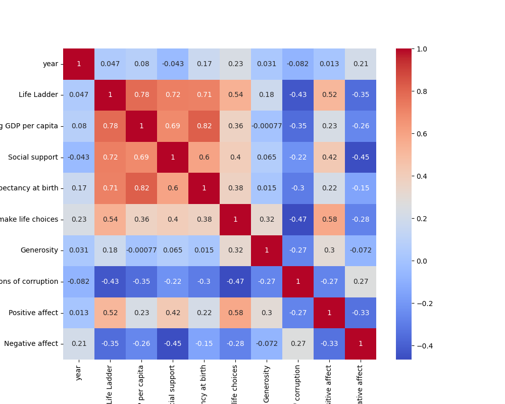
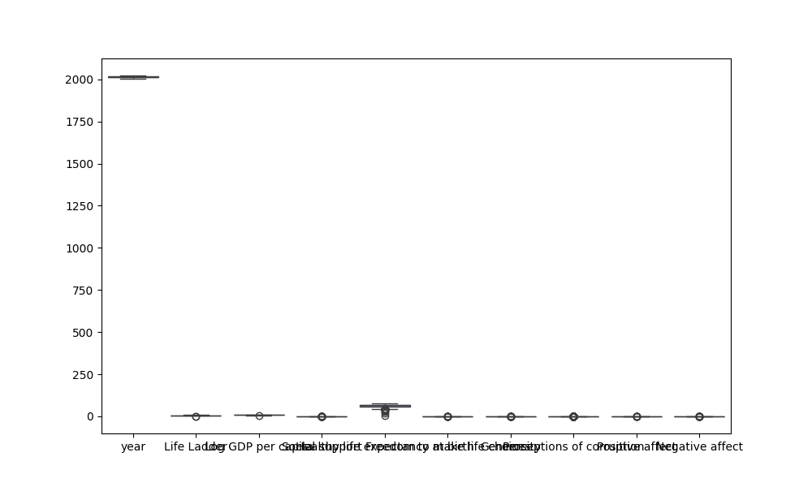
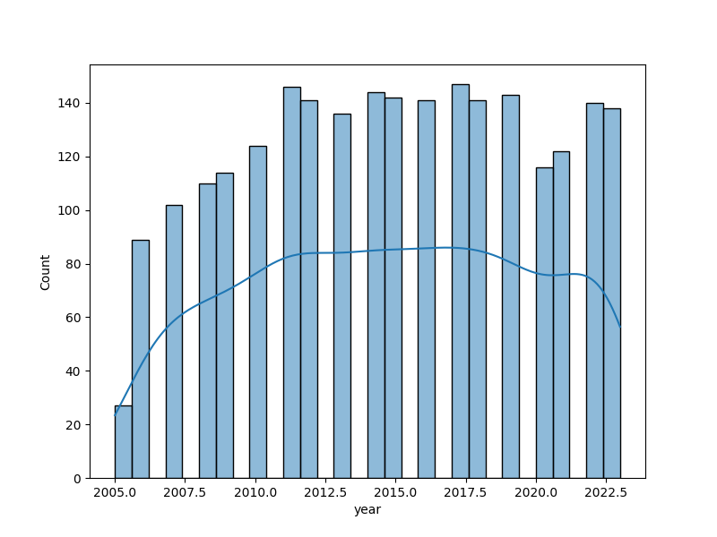
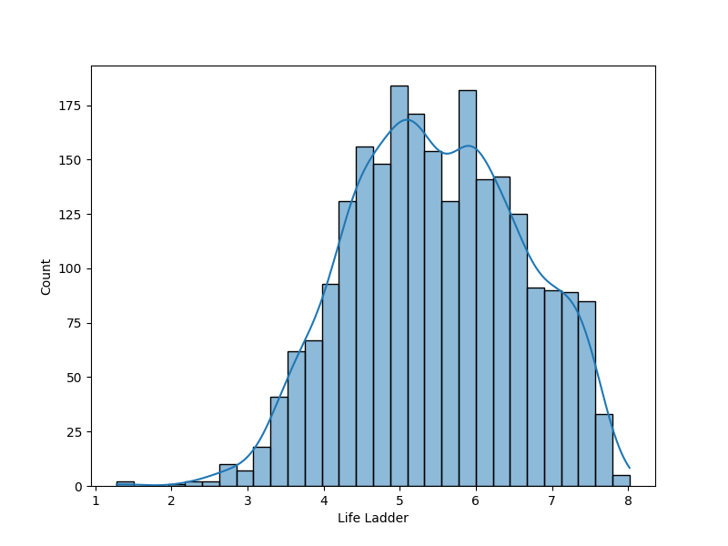
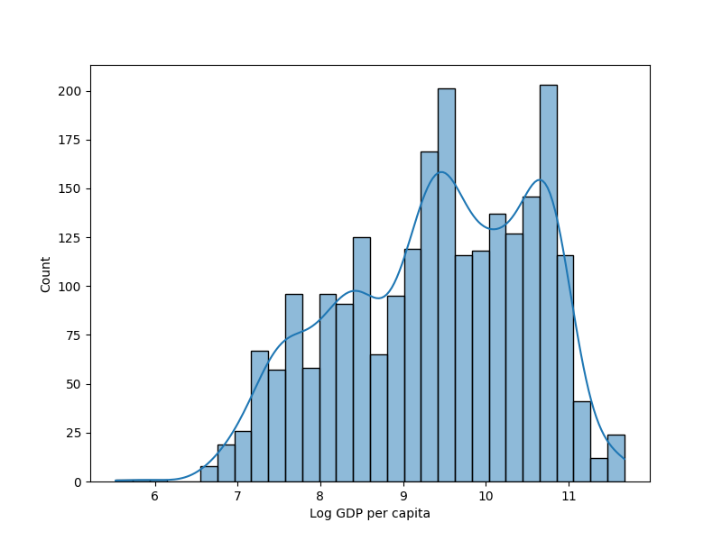
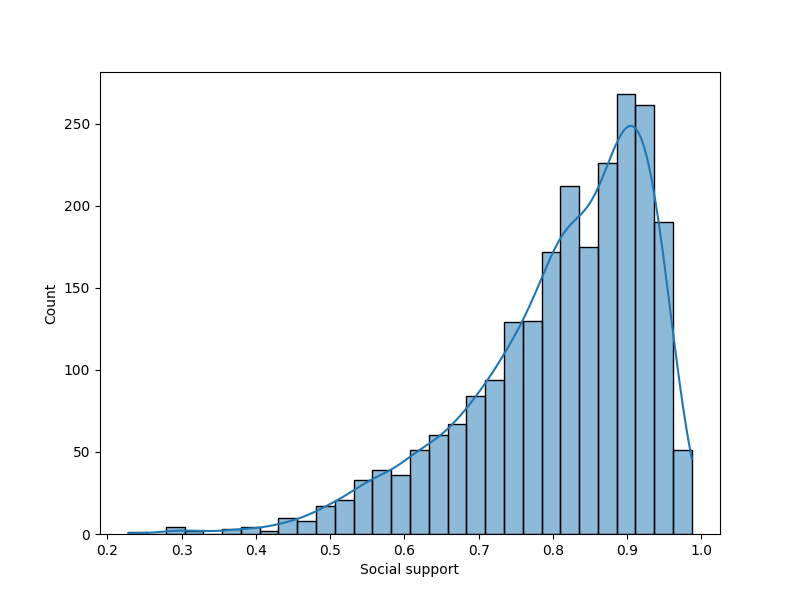
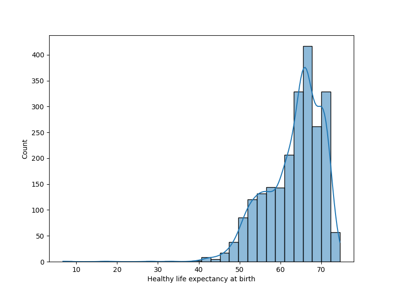
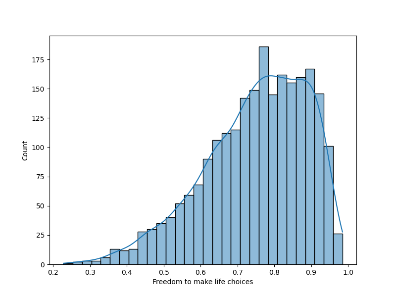
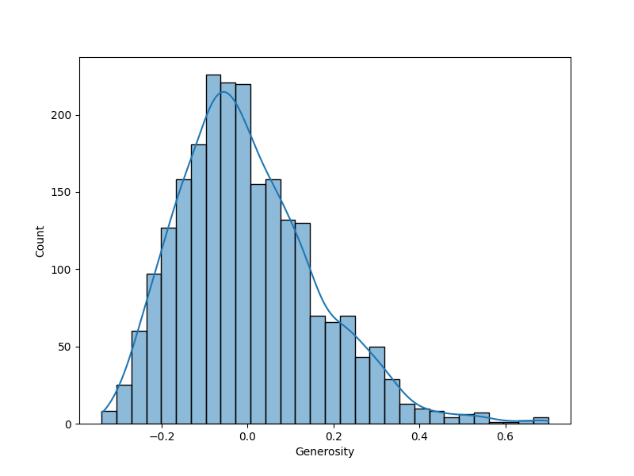
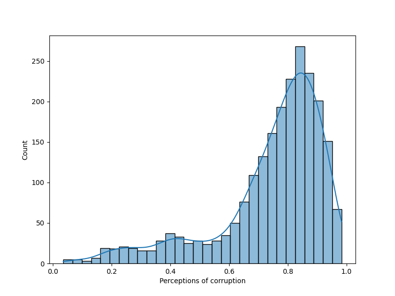
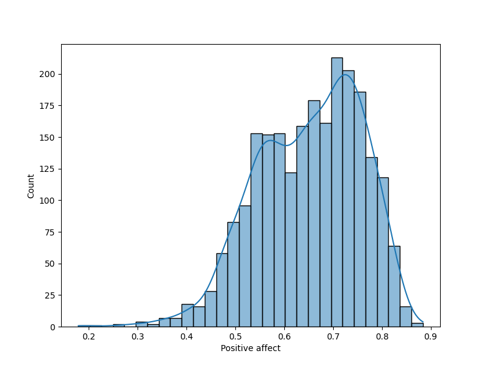
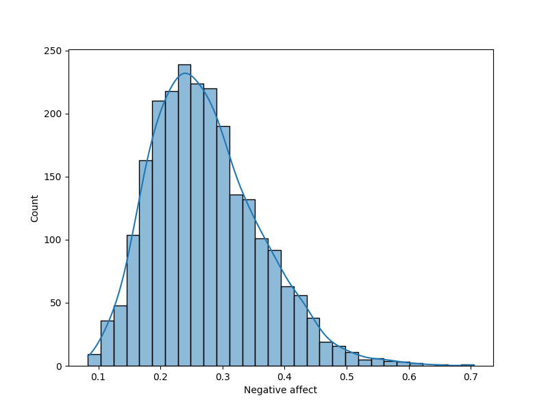

## Insights and Recommendations
Based on the provided data summary, here are the key insights drawn from the summary statistics, missing values, and correlation matrix:

### Summary Statistics

1. **Overall Life Satisfaction (Life Ladder):** 
   - The mean score of 5.48 on the Life Ladder suggests moderate global life satisfaction, with a range from 1.28 to 8.02, indicating some countries experience significantly higher satisfaction levels.

2. **Economic Indicators (Log GDP per capita):**
   - The average Log GDP per capita is approximately 9.40, suggesting a healthy economic backdrop, but there's variation as indicated by a standard deviation of 1.15. The GDP figures range from 5.53 to 11.68, showing a significant economic disparity among countries.

3. **Social Support:**
   - The average score for social support is 0.81, indicating that, generally, people believe they have someone to rely on in times of need. The standard deviation of 0.12 indicates that while most score reasonably high, there are some notable outliers with low support.

4. **Health and Life Expectancy:**
   - The average healthy life expectancy at birth is 63.4 years. This figure has a significant standard deviation (6.84), signaling notable health disparities. The minimum is alarmingly low at 6.72 years, while the maximum is 74.6 years.

5. **Personal Freedom and Generosity:**
   - Freedom to make life choices averages at 0.75, with higher variations in scores. However, generosity seems quite low overall, with a mean close to zero (9.77e-05), suggesting that on average, respondents feel they are not particularly generous.

6. **Perceptions of Corruption and Affects:**
   - Perceptions of corruption yield an average score of 0.74, with a notable negative correlation to Life Ladder scores, suggesting that higher corruption perceptions correlate with lower life satisfaction. Positive and negative affect average at 0.65 and 0.27 respectively, implying a tendency towards a positive outlook overall, although negative affect is also present.

### Missing Values

- A number of variables contain missing values, notably **Healthy life expectancy at birth (63 missing), Generosity (81 missing), and Perceptions of corruption (125 missing)**. This could indicate areas of concern, as substantial missing data can impact the analysis and represent gaps in data collection.

### Correlation Insights

1. **Positive Correlations:**
   - The strongest correlations with Life Ladder (well-being) are found with **Log GDP per capita (0.78), Social support (0.72), and Healthy life expectancy (0.71)**. This indicates that higher GDP, social support, and life expectancy are strongly associated with greater life satisfaction.

2. **Negative Correlations:**
   - Life Ladder shows a strong negative correlation with **Perceptions of corruption (-0.43)** and a moderate negative correlation with **Negative affect (-0.35)**. This emphasizes the impact of corruption and negative experiences on overall perceived well-being.

3. **Freedom to Choose:**
   - There are moderate positive correlations between **Freedom to make life choices** and both **Life Ladder (0.54)** and **Positive affect (0.58)**, indicating that allowing individuals more freedom ties positively into their satisfaction and sense of control in life.

4. **Economic and Health Relationships:**
   - Log GDP per capita shows a strong correlation with healthy life expectancy (0.82), affirming that economic prosperity tends to lead to better health outcomes across the sample.

### Conclusion

Overall, the data indicates a complexity in global life satisfaction influenced by economic factors, social support, health metrics, and personal freedoms. Recommendations moving forward could include targeted initiatives to improve economic conditions, enhance social support systems, and address perceptions of corruption, which together could potentially elevate life satisfaction in various regions. Additionally, identifying and addressing the causes behind significant missing values in key metrics would be crucial for a comprehensive understanding of well-being across the surveyed population.
