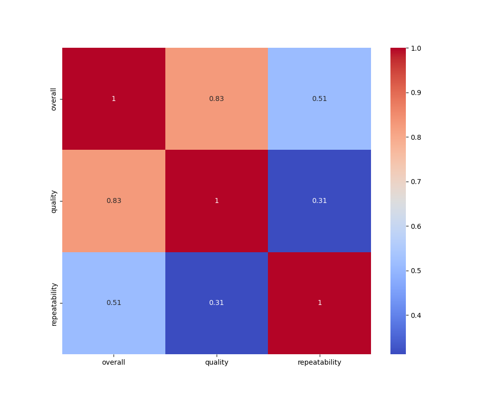
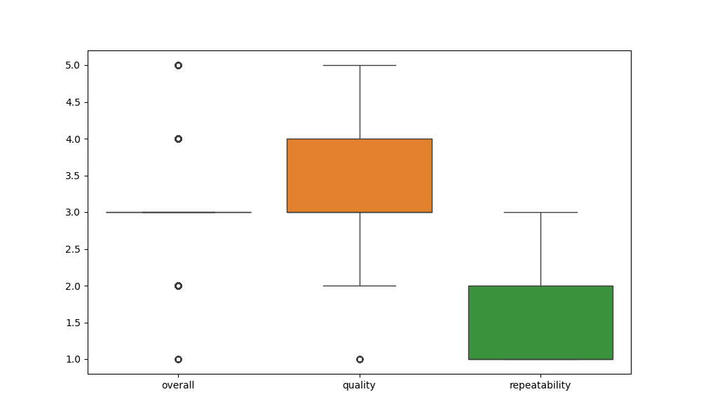
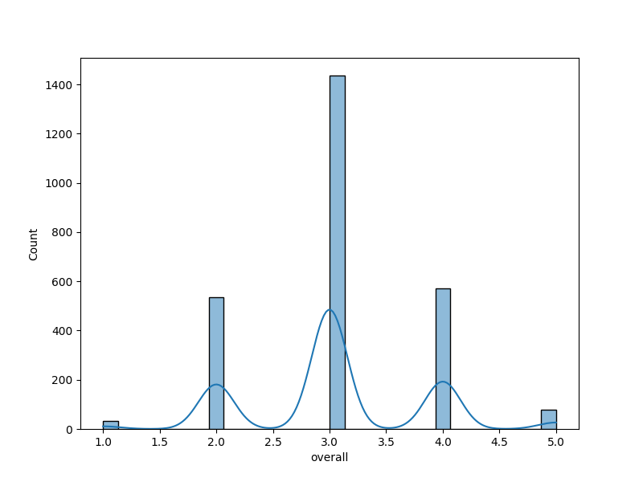
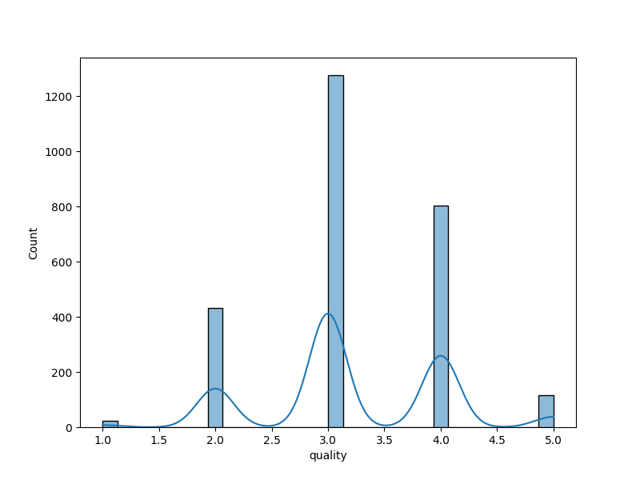
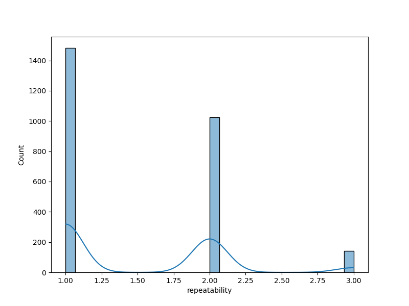

# Data Analysis Report

## Dataset Overview
The dataset contains 2652 rows and 8 columns. Here is a brief overview of the data:
        date language   type        title                             by  \
0  15-Nov-24    Tamil  movie  Meiyazhagan           Arvind Swamy, Karthi   
1  10-Nov-24    Tamil  movie    Vettaiyan        Rajnikanth, Fahad Fazil   
2  09-Nov-24    Tamil  movie       Amaran  Siva Karthikeyan, Sai Pallavi   
3  11-Oct-24   Telugu  movie        Kushi    Vijay Devarakonda, Samantha   
4  05-Oct-24    Tamil  movie         GOAT                          Vijay   

   overall  quality  repeatability  
0        4        5              1  
1        2        2              1  
2        4        4              1  
3        3        3              1  
4        3        3              1  

## Summary Statistics
{'overall': {'count': 2652.0, 'mean': 3.0475113122171944, 'std': 0.762179758096274, 'min': 1.0, '25%': 3.0, '50%': 3.0, '75%': 3.0, 'max': 5.0}, 'quality': {'count': 2652.0, 'mean': 3.2092760180995477, 'std': 0.7967426636666768, 'min': 1.0, '25%': 3.0, '50%': 3.0, '75%': 4.0, 'max': 5.0}, 'repeatability': {'count': 2652.0, 'mean': 1.4947209653092006, 'std': 0.5982894305802061, 'min': 1.0, '25%': 1.0, '50%': 1.0, '75%': 2.0, 'max': 3.0}}

## Missing Values
{'date': 99, 'language': 0, 'type': 0, 'title': 0, 'by': 262, 'overall': 0, 'quality': 0, 'repeatability': 0}

## Correlation Matrix
{'overall': {'overall': 1.0, 'quality': 0.8259352331454309, 'repeatability': 0.5126000083900123}, 'quality': {'overall': 0.8259352331454309, 'quality': 1.0, 'repeatability': 0.31212651153886395}, 'repeatability': {'overall': 0.5126000083900123, 'quality': 0.31212651153886395, 'repeatability': 1.0}}

## Data Visualizations

## Insights and Recommendations
Based on the provided data summary, we can derive several insights:

### Overall Statistics
- **Count:** A considerable sample size of 2,652 was analyzed, which provides a solid basis for statistical reliability.
- **Mean Rating:** The overall mean rating is approximately 3.05, indicating a generally positive assessment but not overwhelmingly so.
- **Standard Deviation:** The standard deviation of 0.76 suggests moderate variability among ratings, with ratings distributed around the mean.
- **Range of Ratings:** The ratings range from a minimum of 1 to a maximum of 5. The fact that most ratings fall around the 3.0 mark (both the 25th and 50th percentiles) indicates a concentration of evaluations at the midpoint.

### Quality Ratings
- **Mean Quality Rating:** The mean for quality is slightly higher at approximately 3.21, suggesting that participants perceive quality more favorably than the overall rating.
- **Interquartile Range:** The 75th percentile is 4.0, implying that 25% of the ratings are above this threshold, which reflects positively on perceived quality.

### Repeatability
- **Low Mean:** The mean repeatability score of about 1.49 suggests that many evaluations are likely seen as unique or not commonly repeated.
- **Distribution of Repeatability:** With 25% of the data scoring at the minimum (1.0) and a maximum of 3.0, most respondents likely do not see frequent repetition in the context being measured (possibly indicative of variability in experiences or assessments).

### Missing Values
- **Date:** There are 99 missing dates, which is notable. While this number itself may not drastically affect the overall analysis, it is essential to determine how these missing values could bias interpretations or efforts to analyze trends over time.
- **By and Overall Fields:** The field 'by' has 262 missing entries, which is significant when relating evaluations to specific evaluators, affecting the ability to attribute ratings directly to individuals or criteria.

### Correlation Insights
- **Overall to Quality:** There is a strong positive correlation (0.83) between overall ratings and quality, indicating that higher quality ratings are associated with higher overall ratings.
- **Overall to Repeatability:** The correlation coefficient of about 0.51 between overall ratings and repeatability suggests a moderate positive relationship, indicating that higher overall ratings may coincide with greater perceived repeatability, though the relationship isn't very strong.
- **Quality to Repeatability:** The correlation of about 0.31 is lower, suggesting that quality perceptions do not necessarily translate strongly into perceptions of repeatability.

### Conclusion
1. The data reflects a generally positive assessment of the subject being measured, particularly regarding quality.
2. There is an opportunity to examine factors contributing to repeatability, as the current low average may indicate areas that need improvement.
3. Attention to missing values, particularly in the 'by' field, is warranted as it could impact the understanding of who provided the evaluations and their possible biases.
4. The strong correlation between overall and quality scores suggests that efforts to improve quality may directly enhance overall perceptions. 

These insights can help drive decisions on focus areas for quality improvements and understanding user evaluations more deeply in future research or projects.
